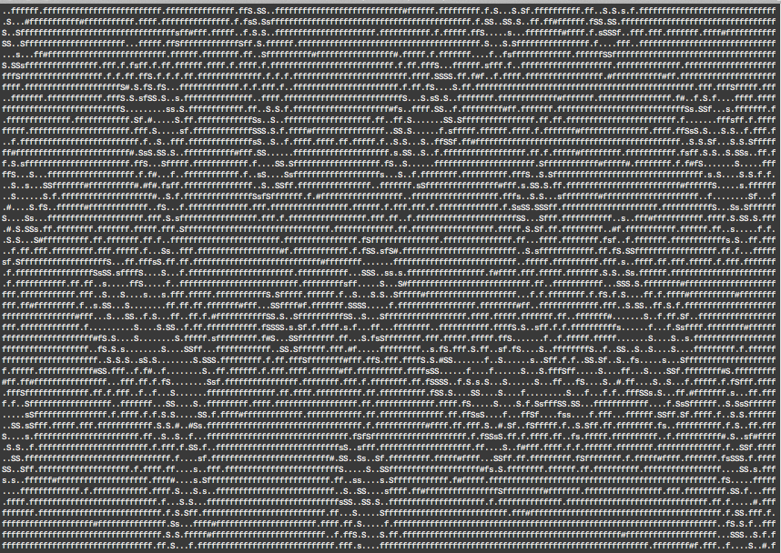

# Cpp-lab-7

## Практикум №7 (Ocean)

### Задание

Разработать систему имитационного моделирования Океан. Моделируется замкнутая экологическая система по принципу хищник-жертва.

В системе рассматриваются сущности:

- **Ocean** - двумерная матрица ячеек.
- **Cell** - ячейка океана, которая может быть либо пустой, либо содержать объект.
- **Object** - объект, который может занимать ячейку океана.
- **Stone** - неподвижный объект океана, просто занимающий ячейку.
- **Prey** - рыба-жертва. Передвигается случайным образом по океану, размножается и умирает через заданные промежутки времени.
- **Predator** - рыба-хищник. Передвигается по океану, поедает рыбу-жертву, размножается. Может умереть от голода.


### Консольная версия

Каждый объект в океане отображается на экране определенным символом. Моделирование предполагает случайное распределение в океане заданного количества камней, жерт и хищников (начальное состояние) и пошаговое изменение состояния океана. Все объекты в течении шага делают свой ход. После этого на экран выводится карта океана и процесс зацикливается.



На приведенном скриншоте показана i-ая итерация океана. Жерты обозначены символом 'f', хищники - 'S'. Видно, что количество жертв существенно больше числа хищников, что создает для последних благоприятные условия для питания и размножения. На экране отображается порядка 5000 объектов.

### Некоторые варианты реализации

Приведем в качестве примера несколько неполных реализаций классов проекта.

Океан:

```c++
#ifndef _OCEAN_H_
#define _OCEAN_H_

#include "common.h"
#include "Cell.h"
#include <list>

class Ocean
{
	
private:
	Cell **cells;
	std::list<Object*> stuff;

public:
	Ocean();
	~Ocean();
	void print() const;
	void addObjects(...);
	void run();
};
#endif
```

Объект:

```c++
#ifndef _OBJECT_H_
#define _OBJECT_H_

#include "common.h"

#define STONE_N '#'
#define CORAL_N '*'
#define PREY_N 'f'
#define PREDATOR_N 'S'

enum class ObjType {STONE,CORAL,PREY,PREDATOR};

class Cell;
class Object
{
protected:
	Cell *cell;
public:
	Object(Cell * = nullptr);
	virtual ~Object();
	virtual void live() = 0; // жизнь объекта
	void setCell(Cell*);
};
#endif
```

Ячейка:

```c++
#ifndef _CELL_H_
#define _CELL_H_

#include "common.h"
#include "Object.h"

class Ocean;

class Cell
{
	friend Ocean;
private:
	Pair crd;
	Object *obj;
	Ocean *ocean;
public:
	explicit Cell(Pair p = { 0, 0 }, Ocean* oc = nullptr) :
		crd(p),
		obj(nullptr),
		ocean(oc) {}
	void init(Pair p, Ocean* oc);
	Object* getObject() const;
	void setObject(Object*);
	void killMe();

};
#endif
```

Файл с общими настройками:

```c++
#ifndef _COMMON_H_
#define _COMMON_H_

typedef size_t coord_t;

struct Pair
{
	coord_t x; // 0..M-1
	coord_t y; // 0..N-1
};

const size_t N = 20;
const size_t M = 50;

#endif
```

 
## Список участников/веток

|  ФИО              | Имя ветки |
|-------------------|-----------|
|Альперович	Вадим | b1|
|Андрющенко	Александр|b2|
|Аросланкин	Артем|b3|
|Востряков	Дмитрий|b4|
|Горбачева	Арина|b5|
|Горшкова	Екатерина|b6||
|Доненко	Денис|b7|
|Исупова	Мария|b8|
|Кислицына	Анастасия|b9|
|Куклин	Максим|b10|
|Лесин	Николай|b11|
|Макридин	Максим|b12|
|Максимов	Антон|b13|
|Малинин	Василий|b14|
|Мартиросян	Елизавета|b15|
|Мурзаев	Роман|b16|
|Сазанов	Дмитрий|b17|
|Седунов	Илья|b18|
|Сиднева	Анастасия|b19|
|Ситникова	Владислава|b20|
|Слесарева	Василина|b21|
|Смольникова	Полина|b22|
|Тюлин	Владислав|b23|
|Филиппова	Марина|b24|
|Черноземова	Дарья|b25|
|Чернышев	Константин|b26|
|Черняев	Ярослав|b27|
|Втюрин Павел|b28|
|Славутин Александр|b29|
|Семкин Павел|b30|

## Алгоритм выполнения работы

Для выполнения работы необходимо:

1. Выполнить *fork* репозитария в свой аккаунт.
1. Выполнить клонирование репозитария из своего аккаунта к себе на локальную машину (`git clone`).
1. Создать ветку **git** с индивидуальным номером (`git branch имя_ветки`).
1. Сделать ветку активной (`git checkout имя`).
1. Необходимо разместить как исходные файлы с решениями задач, поместив **cpp** файлы в **src**, а заголовочные - в **include**. 
1. Добавить файлы в хранилище (`git add`).
1. Выполнить фиксацию изменений (`git commit -m "комментарий"`).
1. Отправить содержимое ветки в свой удаленный репозитарий (`git push origin имя_ветки`).
1. Создать пул-запрос в репозитарий группы и ждать результата от **Travis-CI**.

